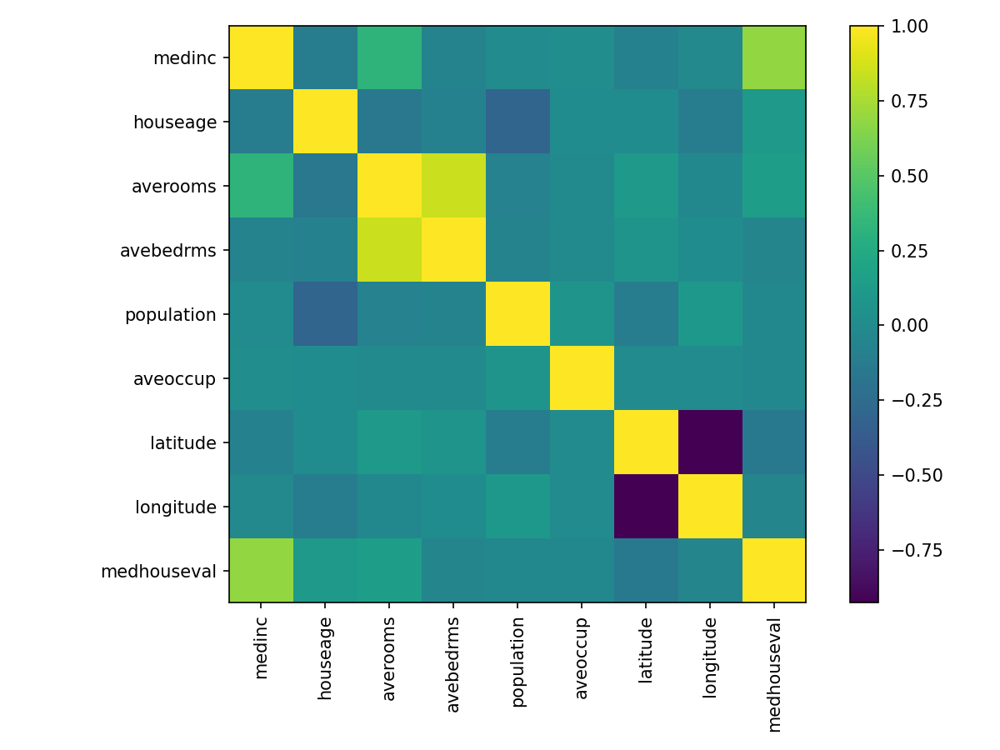
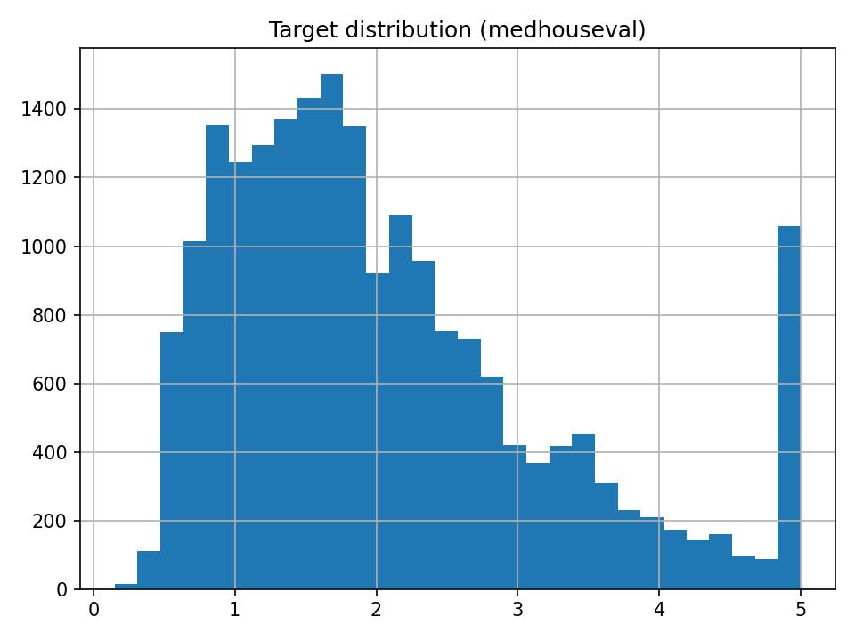

# ml-playground

Minimal end-to-end ML playground with:
- sklearn pipeline + MLflow tracking
- FastAPI inference service
- pre-commit (black/ruff), pytest, and GitHub Actions CI

## Quickstart

```bash
python3 -m venv .venv && source .venv/bin/activate
python -m pip install --upgrade pip
pip install -r requirements.txt

pre-commit install

# Run tests & lint
pytest -q
ruff check .

# Train baseline & log to MLflow local dir
export MLFLOW_TRACKING_URI="mlruns"
python -m src.train_baseline
mlflow ui -h 127.0.0.1 -p 5000  # open http://127.0.0.1:5000

# Start FastAPI for inference
uvicorn src.app:app --reload
# In another terminal:
# curl -X POST http://127.0.0.1:8000/predict -H 'Content-Type: application/json' -d '{"x":[0.1,0.2,0.3,0.4,0.5,0.6,0.7,0.8,0.9,1,1,1,1,1,1,1,1,1,1,1,1,1,1,1,1,1,1,1,1]}'
# ml-playground


## EDA Figures



## Quickstart
```bash
# 1) setup
python3 -m venv .venv
source .venv/bin/activate
pip install -r requirements.txt
pre-commit install
pre-commit run -a
pytest -q

# 2) train (MLflow logs to ./mlruns)
export MLFLOW_TRACKING_URI=mlruns
python -m src.train_baseline

# 3) serve API
uvicorn src.app:app --reload


```

## Project layout
```
ml-playground/
  src/
    __init__.py
    train_baseline.py
    app.py
  tests/
    test_smoke.py
  notebooks/
  data/
  models/
  .github/workflows/ci.yml
```
